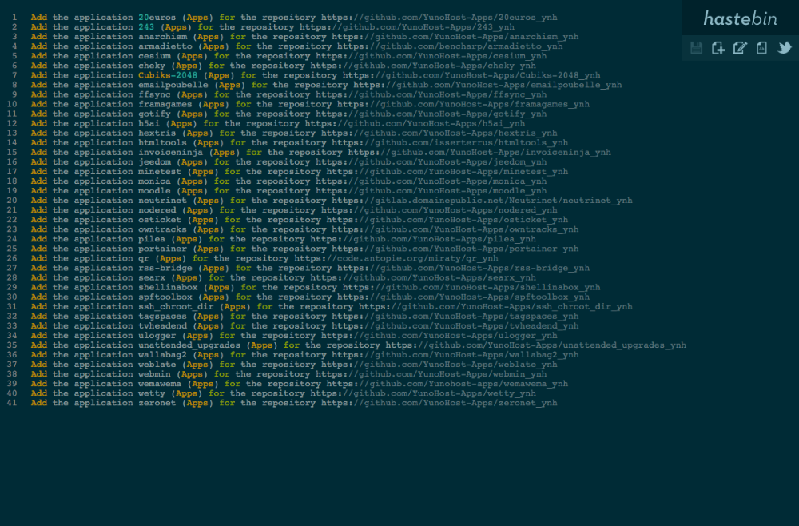

<!--
N.B.: This README was automatically generated by https://github.com/YunoHost/apps/tree/master/tools/README-generator
It shall NOT be edited by hand.
-->

# Haste for YunoHost

[](https://dash.yunohost.org/appci/app/haste)  

[](https://install-app.yunohost.org/?app=haste)

*[Lire ce readme en français.](./README_fr.md)*

> *This package allows you to install Haste quickly and simply on a YunoHost server.
If you don't have YunoHost, please consult [the guide](https://yunohost.org/#/install) to learn how to install it.*

## Overview

Haste is an open-source pastebin software written in node.js, which is easily installable in any network. YunoHost Project uses Haste as pastebin for log sharing: [paste.yunohost.org](https://paste.yunohost.org/)


**Shipped version:** 0.1.0~ynh14

**Demo:** http://hastebin.com/

## Screenshots



## Documentation and resources

* Official app website: <http://hastebin.com/>
* Official user documentation: <https://hastebin.com/about.md>
* Upstream app code repository: <https://github.com/seejohnrun/haste-server>
* YunoHost documentation for this app: <https://yunohost.org/app_haste>
* Report a bug: <https://github.com/YunoHost-Apps/haste_ynh/issues>

## Developer info

Please send your pull request to the [testing branch](https://github.com/YunoHost-Apps/haste_ynh/tree/testing).

To try the testing branch, please proceed like that.

``` bash
sudo yunohost app install https://github.com/YunoHost-Apps/haste_ynh/tree/testing --debug
or
sudo yunohost app upgrade haste -u https://github.com/YunoHost-Apps/haste_ynh/tree/testing --debug
```

**More info regarding app packaging:** <https://yunohost.org/packaging_apps>
