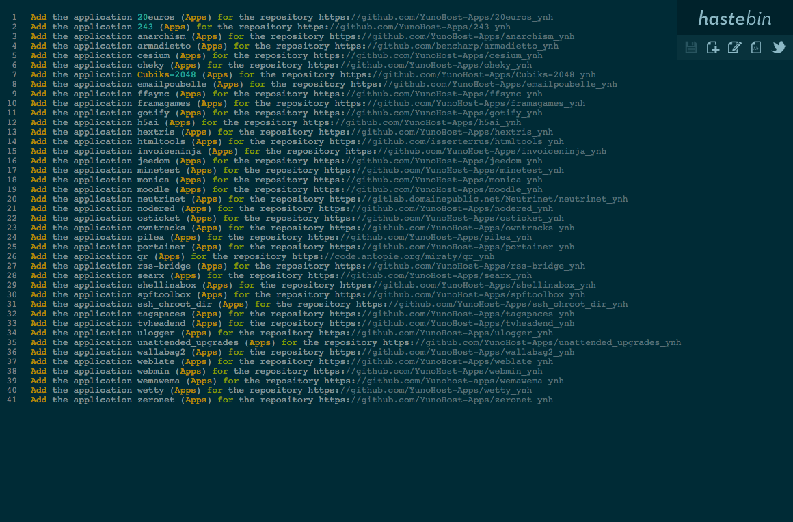

# Haste pour YunoHost

[](https://dash.yunohost.org/appci/app/haste)    
[](https://install-app.yunohost.org/?app=haste)

*[Read this readme in english.](./README.md)* 

> *Ce package vous permet d'installer Haste rapidement et simplement sur un serveur YunoHost.  
Si vous n'avez pas YunoHost, consultez [le guide](https://yunohost.org/#/install) pour apprendre comment l'installer.*

## Vue d'ensemble
Haste est un logiciel pastebin open-source écrit en node.js, facilement installable sur n'importe quel réseau. Le projet YunoHost utilise Haste comme pastebin pour le partage de log : [paste.yunohost.org](https://paste.yunohost.org/)

**Version incluse :** 0.1.0 (7.10.2020)

## Captures d'écran



## Démo

* [Démo officielle](http://hastebin.com/)

## Configuration

 * Comment configurer cette application: un fichier brut en SSH.

## Documentation

 * Documentation officielle: https://hastebin.com/about.md
 * Documentation YunoHost: https://yunohost.org/fr/app_haste

## Caractéristiques spécifiques YunoHost

#### Support multi-utilisateur

* L'authentification LDAP et HTTP est-elle prise en charge ? **Non**
* L'application peut-elle être utilisée par plusieurs utilisateurs ? **Oui**

#### Architectures supportées

* x86-64 - [](https://ci-apps.yunohost.org/ci/apps/haste/)
* ARMv8-A - [](https://ci-apps-arm.yunohost.org/ci/apps/haste/)

## Limitations

* Limitations connues.

## Informations additionnelles

## `haste` command

Ce paquet de Haste pour YunoHost comprend une commande [`haste`](https://github.com/diethnis/standalones/blob/master/hastebin.sh), vous permettant de partager du contenu avec le terminal :

```bash
cat something | haste
https://haste.example.com/zuyejeduzu
```

Le [client Haste](https://github.com/seejohnrun/haste-client) est un client simple pour télécharger des données sur votre serveur Haste.

## Liens

 * Signaler un bug : https://github.com/YunoHost-Apps/haste_ynh/issues
 * Dépôt de l'application principale : https://github.com/seejohnrun/haste-server
 * Site web YunoHost : https://yunohost.org/

---

## Informations pour les développeurs

Merci de faire vos pull request sur la [branche testing](https://github.com/YunoHost-Apps/haste_ynh/tree/testing).

Pour essayer la branche testing, procédez comme suit.
```
sudo yunohost app install https://github.com/YunoHost-Apps/haste_ynh/tree/testing --debug
ou
sudo yunohost app upgrade haste -u https://github.com/YunoHost-Apps/haste_ynh/tree/testing --debug
```
